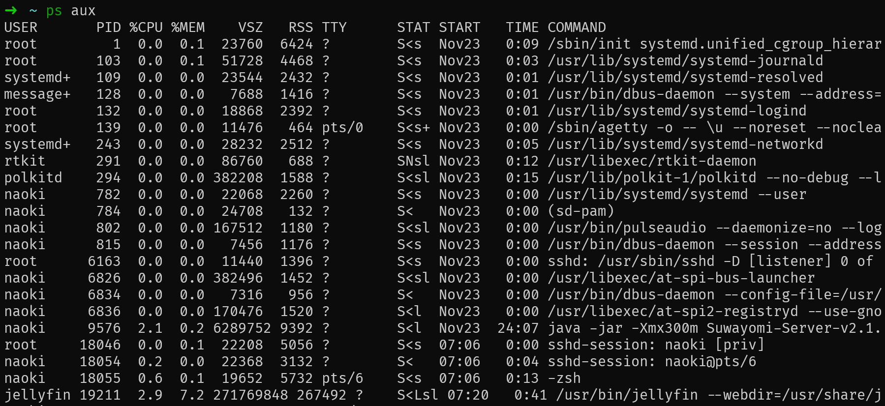
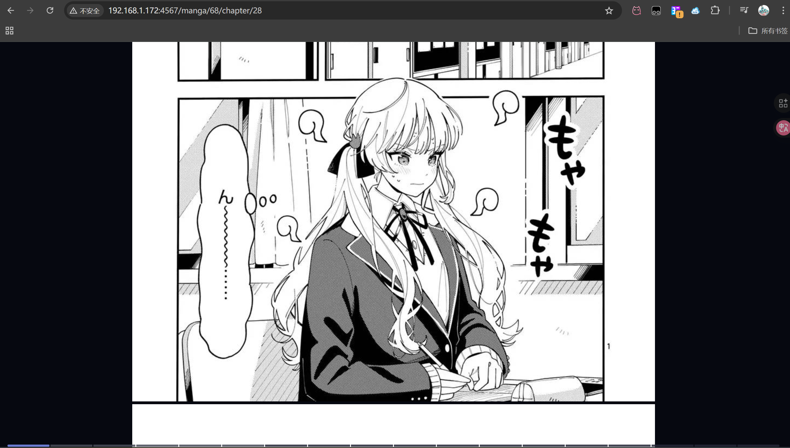
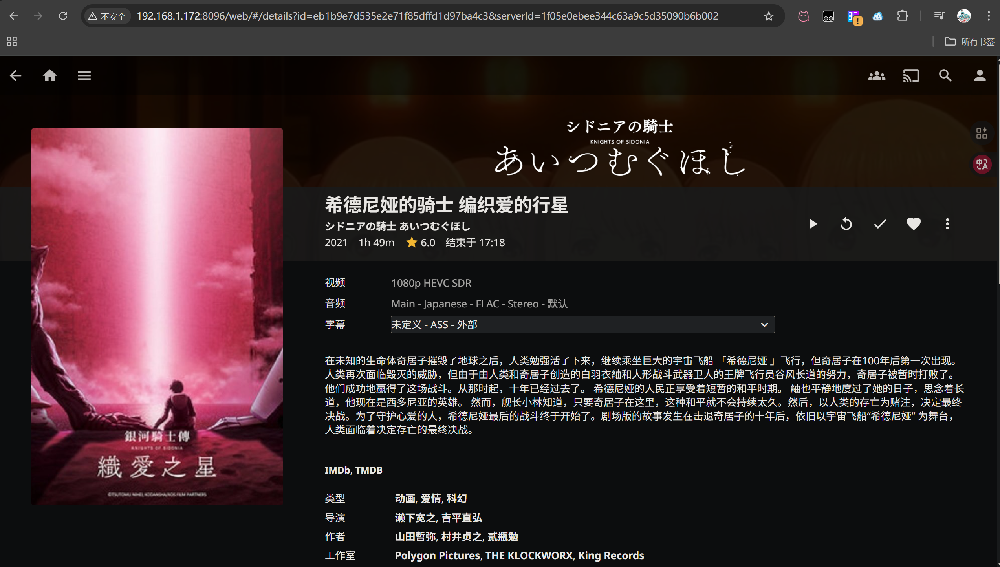

# 一.为LXC容器挂载GPU设备(通用思路)
修改容器的配置文件
```Bash
# 使用adb shell或者终端app
su  # 获得root身份
ls -l /dev/dri
```
此时可能出现以下输出
```Plain Text
crw-rw-rw-. 1 root 1003 226,   0 May 13  1971 card0
crw-rw-rw-. 1 root 1003 226,  64 May 13  1971 controlD64
crw-rw-rw-. 1 root 1003 226, 128 May 13  1971 renderD128
```
**请记住**`226, 0`这串数字，这是/dev/dri/card0的设备号，在你的设备上可能不同，以你自己的设备为准

```Bash
ls -l /dev/dri
ls -l /dev/kgsl-3d0

# 在我的Pixel 3XL上
ls -l /dev/ion      #(旧版，Android 4.x-10)ION内存分配器，用于在CPU和GPU/DSP等硬件间共享内存@deepseek

# 在我的Redmi K50 Ultra上
ls -l /dev/dma_heap/system  #(新版，Android 11+)DMA-BUF Heaps，ION的现代化替代品@deepseek
```

>使用mt管理器修改`/data/lxc/(你的容器存放路径)/config`
```Plain Text
# 在末尾添加设备权限:
# 根据你的设备更改 c 后面的数字部分
# 请注意，这里均说明的是cgroup v2的配置
lxc.cgroup2.devices.allow = c 226:0 rwm     # /dev/dri/card0
lxc.cgroup2.devices.allow = c 226:64 rwm    # /dev/dri/controlD64 此项在你的设备上可能不存在，存在即添加@deepseek
lxc.cgroup2.devices.allow = c 226:128 rwm   # /dev/dri/renderD128
lxc.cgroup2.devices.allow = c 236:0 rwm     # /dev/kgsl-3d0
# 在我的Pixel 3XL上
lxc.cgroup2.devices.allow = c 10:62 rwm     # /dev/ion
# 在我的Redmi K50 Ultra上
lxc.cgroup2.devices.allow = c 248:1 rwm     # /dev/dma_heap/system

# 挂载设备:
lxc.mount.entry = /dev/dri dev/dri none bind,optional,create=dir
lxc.mount.entry = /dev/kgsl-3d0 dev/kgsl-3d0 none bind,optional,create=file
#在我的Pixel 3XL上
lxc.mount.entry = /dev/ion dev/ion none bind,optional,create=file
#在我的Redmi K50 Ultra上
lxc.mount.entry = /dev/dma_heap/system dev/dma_heap/system none bind,optional,create=file
lxc.mount.entry = /dev/input dev/input none bind,optional,create=dir
```

# 二.修改tomxi1997的Lxc管理模块的lxc-images镜像地址(默认清华源已经很久未更新)
mt管理器打开/data/lxc/lxc-manager.c和/data/lxc/lxc-manager.sh，查找mirrors.tuna.tsinghua替换为mirror.nju

# 三.有什么用？

搭建Suwayomi-server




# 存在的问题：
目前(2025-11-24)，在LXC中无法正常启动Arch Linux ARM(需要你自己修改)
