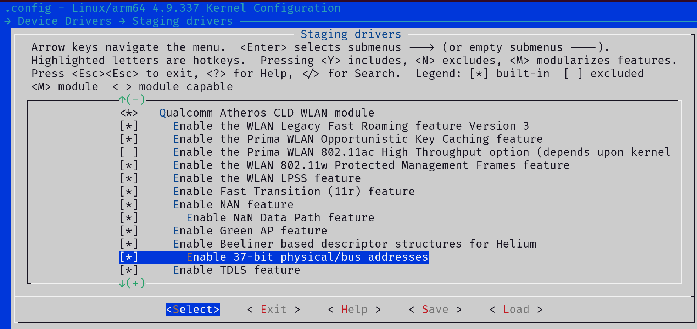
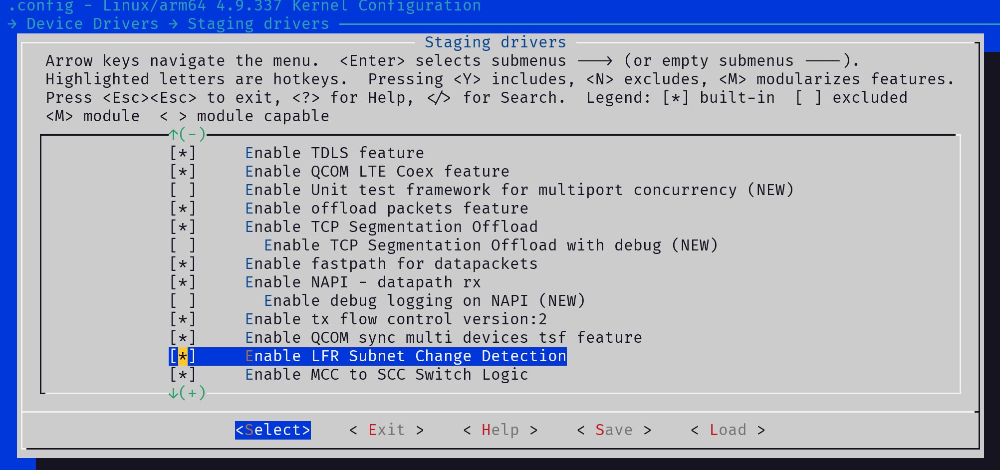

# Pixel-3-XL 内核编译与定制教程

## 1. 准备环境

- 系统要求：Ubuntu-22.04/Debian12 或其他 Linux 发行版（本文使用 Debian12）

- 配置前置：镜像源、普通用户、代理等

## 2. 安装必要软件包

```Bash

sudo apt install -y curl llvm lld wget vim git ccache automake flex lzop bison gperf build-essential zip zlib1g-dev g++-multilib libxml2-utils bzip2 libbz2-dev libbz2-1.0 libghc-bzlib-dev squashfs-tools pngcrush schedtool dpkg-dev liblz4-tool make optipng maven libssl-dev pwgen libswitch-perl policycoreutils minicom libxml-sax-base-perl libxml-simple-perl bc libc6-dev-i386 lib32ncurses5-dev x11proto-core-dev libx11-dev lib32z-dev libgl1-mesa-dev xsltproc unzip device-tree-compiler kmod python3 python3-pip python-is-python3 lld git wget curl apt-transport-https unzip neovim
```

## 3. 准备内核及工具链（使用 repo 工具下载谷歌官方资源）

### 3.1 创建目录

```Bash

mkdir ~/crosshatch
# 配置git信息(修改""内的内容为自己的信息)
git config --global user.email "xxx@xxx.com"
git config --global user.name "xxx"

```


### 3.2 安装 repo 工具

```Bash
mkdir ~/bin
PATH=~/bin:$PATH
curl https://mirrors.tuna.tsinghua.edu.cn/git/git-repo > ~/bin/repo
chmod +x ~/bin/repo

# 打开repo文件修改内容：
nvim ~/bin/repo
```

将 `REPO_URL = 'https://gerrit.googlesource.com/git-repo'` 改为 `REPO_URL = 'https://mirrors.tuna.tsinghua.edu.cn/git/git-repo'`

### 3.3 下载内核源码及工具链

```Bash
cd crosshatch
repo init -u https://mirrors.tuna.tsinghua.edu.cn/git/AOSP/platform/manifest -b android-12.0.0_r1
repo sync -c --no-tags -j20     # -j 后面的20改为你的处理器核心数
```

- 下载完成后，内核文件路径：`~/crosshatch/private/msm-google/`

### 3.4 可选操作:替换成lineageOS(或者其他内核)维护的内核 (如需替换为他人维护的内核，先备份 `msm-google` 文件夹再替换)

```Bash
    cd ~/crosshatch/private
    mv msm-google origin    #备份原内核
    git clone --depth 1 --branch lineage-22.2 https://github.com/LineageOS/android_kernel_google_msm-4.9.git msm-google
```

## 4. 内核定制修改

### 4.1 进入内核源码目录

```Bash
cd private/msm-google
```

### 4.2 基础配置修改

```Bash
nvim build.config.bluecross_no-cfi
```

注释内容：`POST_DEFCONFIG_CMDS="check_defconfig && update_nocfi_config"`

### 4.3 驱动整合（确保开机声音、WIFI、触摸正常）

```Bash
nvim techpack/audio/config/b1c1auto.conf
```
将文件中所有 `m` 改为 `y`


```Bash
#修改 Kconfig
nvim drivers/staging/Kconfig
```
在倒数第二行添加：`source "drivers/staging/qcacld-3.0/Kconfig"`（如果你和我一样使用lineageOS内核，你需要注释`config QCA_CLD_WLAN`相关内容然后进行添加操作）


```Bash
# 修改Makefile
nvim drivers/staging/Makefile
```

末尾添加：`obj-$(CONFIG_QCA_CLD_WLAN)+= qcacld-3.0/`（LineageOS 内核通常已存在，无需修改）


将**private/msm-google-modules/wlan/**下的三个目录复制到**private/msm-google/drivers/staging/**目录下（在**LineageOS的内核源码**中，这些文件可能已经存在，你可以先`ls -l drivers/staging/`查看）
```Bash
cp -r ~/crosshatch/private/msm-google-modules/wlan/* ~/crosshatch/private/msm-google/drivers/staging/
```

### 4.4 可选：添加 KernelSU 支持

```Bash
curl -LSs "https://raw.githubusercontent.com/tiann/KernelSU/main/kernel/setup.sh" | bash -s v0.9.5
# 修改配置文件
nvim arch/arm64/configs/b1c1_defconfig
```

添加以下内容：

```Plain Text
CONFIG_KPROBES=y
CONFIG_HAVE_KPROBES=y
CONFIG_KPROBE_EVENTS=y
```

### 4.5 应用 `path_umount` 补丁

```Bash
# 参考kernelSU的说明，需要移植path_umount以获得卸载模块的功能
# 创建补丁文件
nvim path_umount.patch
```

添加以下补丁内容：

```Diff
--- a/fs/namespace.c
+++ b/fs/namespace.c
@@ -1739,6 +1739,39 @@ static inline bool may_mandlock(void)
 }
 #endif

+static int can_umount(const struct path *path, int flags)
+{
+	struct mount *mnt = real_mount(path->mnt);
+
+	if (flags & ~(MNT_FORCE | MNT_DETACH | MNT_EXPIRE | UMOUNT_NOFOLLOW))
+		return -EINVAL;
+	if (!may_mount())
+		return -EPERM;
+	if (path->dentry != path->mnt->mnt_root)
+		return -EINVAL;
+	if (!check_mnt(mnt))
+		return -EINVAL;
+	if (mnt->mnt.mnt_flags & MNT_LOCKED) /* Check optimistically */
+		return -EINVAL;
+	if (flags & MNT_FORCE && !capable(CAP_SYS_ADMIN))
+		return -EPERM;
+	return 0;
+}
+
+int path_umount(struct path *path, int flags)
+{
+	struct mount *mnt = real_mount(path->mnt);
+	int ret;
+
+	ret = can_umount(path, flags);
+	if (!ret)
+		ret = do_umount(mnt, flags);
+
+	/* we mustn't call path_put() as that would clear mnt_expiry_mark */
+	dput(path->dentry);
+	mntput_no_expire(mnt);
+	return ret;
+}
 /*
  * Now umount can handle mount points as well as block devices.
  * This is important for filesystems which use unnamed block devices.
```
```Bash
# 应用补丁
chmod +x ./path_umount.patch
git apply ./path_umount.patch
```

### 4.6 添加 LXC/Docker 支持
使用了 [tomxi1997](http://www.coolapk.com/u/25509431)大佬 的一键配置，你也可以自行在配置文件中添加选项
```Bash
git clone https://github.com/tomxi1997/lxc-docker-support-for-android.git utils
# 修改Kconfig
nvim ./Kconfig
```
添加：`source "utils/Kconfig"`

```Bash
# 修改配置文件
nvim arch/arm64/configs/b1c1_defconfig
```

末尾添加：

```Plain Text
CONFIG_DOCKER=y
CONFIG_LOCALVERSION="-LXC-KernelSU-QwQ"     # ""内的内容可自行修改
# CONFIG_LOCALVERSION_AUTO is not set
# CONFIG_ANDROID_PARANOID_NETWORK is not set
CONFIG_VLAN_8021Q=y
```

### 4.7 生成并调整配置文件

```Bash
make ARCH=arm64 b1c1_defconfig
make ARCH=arm64 menuconfig
```

配置菜单操作：
键盘↑↓键选择，空格键切换选项，回车进入选项，双击ESC键返回上一级，←→控制下面一排的选项，"/?"键搜索
1. `Networking support` → `Networking options` → 开启 IP: tunneling

2. `Device Drivers` → `Input device support` → Touchscreens → 将 [M] 改为 [*]（LineageOS 内核无需操作）

3. `Device Drivers` → `Staging drivers` → 开启 Qualcomm Atheros CLD WLAN module

然后参考下图开启配置：




4. 按自己需要开启内核选项

5. ←→键将光标调整至Save，按回车键保存配置，长按 ESC 退出

### 4.8 保存配置文件

```Bash
# 首先备份b1c1_defconfig
cp b1c1_defconfig b1c1_defconfig_backup
make ARCH=arm64 savedefconfig
cp defconfig arch/arm64/configs/b1c1_defconfig
rm .config
```
此时可以重新生成配置文件打开配置菜单，查看刚刚打开的选项是否成功保存，这里不赘述

## 5. 编译内核

```Bash
cd ~/crosshatch;
chmod +x build_bluecross.sh
./build_bluecross.sh
```

- 编译完成后，内核文件路径：`out/android-msm-pixel-4.9/dist/Image.lz4`

- 若报错，需先解决报错再重新编译

## 6. 打包 boot 镜像（基于 LineageOS-22.2）

### 6.1 准备文件

1. 下载 LineageOS 的 boot.img（或者准备你需要的boot镜像）

2. 下载 Magisk 安装包，改后缀为 .zip 并解压

### 6.2 推送文件到手机

```Bash
mv Magisk-xxx.apk Magisk-xxx.zip
unzip Magisk-xxx.zip
adb push Magisk-*/lib/arm64-v8a/libmagiskboot.so /data/local/tmp/magiskboot
adb push ~/crosshatch/out/android-msm-pixel-4.9/dist/Image.lz4 /data/local/tmp/
adb push boot.img /data/local/tmp/
```

- 若报错：开启开发者选项中的「允许 root 身份调试」，执行 `adb root`，再执行 `adb push` 命令

### 6.3 解包并打包boot镜像

这里直接参考kernelSU官网的教程

```Bash
adb shell   #请先执行adb root
# 进入Android shell后
cd /data/local/tmp
chmod +x ./magiskboot
./magiskboot unpack boot.img
# 此时得到一个kernel文件，你可以执行file kernel和file Image.lz4对比输出信息
mv -f Image.lz4 kernel
# 重新打包镜像
./magiskboot repack boot.img
# 此时你会得到一个 new-boot.img 的文件，使用这个文件 fastboot 刷入设备即可
```
- 生成新镜像：`new-boot.img`（可以先临时启动boot,查看内核标识是否是你自定义的，然后确认功能无误后刷入）

## 7. 后续配置

### 7.1 KernelSU 说明

- 内核版本 4.9 仅支持 KernelSU v0.9.5，你可以使用的APP版本[1.0.1](https://github.com/tiann/KernelSU/releases/v1.0.1/)

- 我依然建议你使用面具进行管理

### 7.2 LXC（你可以选择tomxi1997大佬的lxc管理模块，或者参考视频自行**[静态编译lxc（使用musl库）]**(https://www.bilibili.com/video/BV1veuFzaE8N)）

- 下载模块：[LXC-5.0-Pro_Magisk-android24-R5.1.zip](https://github.com/tomxi1997/termux-packages/releases/download/v20/LXC-5.0-Pro_Magisk-android24-R5.1.zip)

- 刷入后通过 Termux 或 adb shell 以root身份运行 lxc 命令即可使用

### 7.3 网络问题修复

- 启动 LXC 容器后，网络开关可能会出现时开时关的现象，此时可以关闭WiFi开关，随后等待一段时间后再打开WiFi就可以正常使用

# 附录
**使用你安卓上的LXC:**[Usage](./LXC/README.md)

# 参考资料
**Android源码定制-编译Pixel3内核解决触摸声音WiFi异常**:[link](https://mp.weixin.qq.com/s?__biz=MzU1NjYyNjA3MQ==&mid=2247485043&idx=1&sn=f0c7f008d27851ee0d88780711eebb21&chksm=fbc37f8bccb4f69d666182c9a22b97dc7776c62fc67303bb08dcf75944e2637649aa2ee66028&mpshare=1&scene=23&srcid=0706c2VKK7bFY5X50Qc7aQEU&sharer_sharetime=1688653779744&sharer_shareid=f3dd87dafbf3fa6c2772d66af5f1c719#rd)
